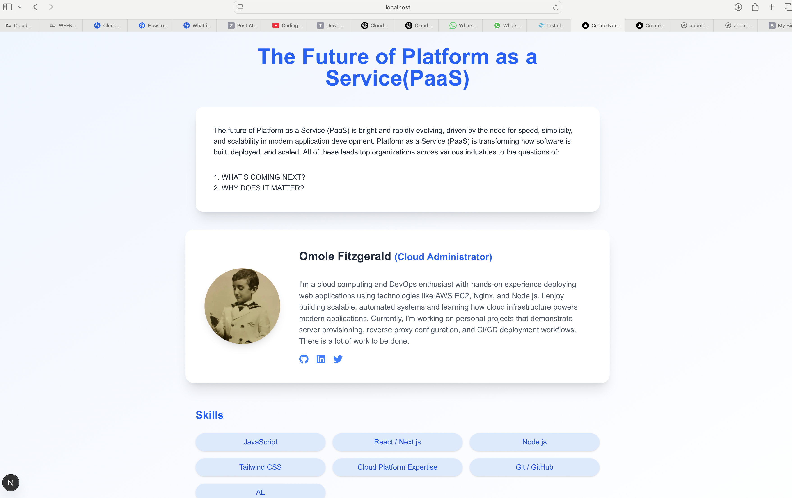

💡 THE FUTURE OF PLATFORM AS A SERVICE (PaaS)

This project demonstrates full-stack deployment, server provisioning, reverse proxy configuration, and frontend development — all essential skills for a cloud engineer.

The future of PaaS lies in seamless developer experiences and automatic scaling infrastructure. This prototype envisions a smart PaaS tool that helps startups deploy with minimal configuration, faster delivery, and cost-efficient scalability — built on the flexibility of open-source frameworks and cloud-native services.

🛠️ Tech Stack

Cloud Provider: AWS EC2 (Ubuntu 22.04)
Web Server: Nginx (Reverse proxy)
Application Framework: Node.js (Next.js 15)
Frontend Enhancements: TailwindCSS, React Icons
Deployment: GitHub → EC2 via Git
Security: UFW Firewall, Ports 80 and 443 allowed
📦 Project Structure

bioaltschool/
├── app/
│   └── page.js         # Dynamic landing page
├── public/             # Static assets
├── styles/             # Tailwind & CSS
├── package.json
├── next.config.mjs
└── README.md
✨ Features

Responsive landing page with:
Name & role
Project pitch
Professional bio
Deployed via Nginx reverse proxy to EC2 instance
Optional: SSL with Let's Encrypt (Certbot ready)
GitHub integration for version control and deployment
📄 Step-by-Step Setup

1. ✅ Provision EC2 Ubuntu Server
Launched EC2 instance (Ubuntu 22.04)
Created and downloaded .pem key pair
Connected via SSH
2. 🌐 Install Nginx & Configure Reverse Proxy
   -sudo apt update && sudo apt install nginx
Restarted Nginx:
   sudo nginx -t
   sudo systemctl reload nginx
3. 📦 Deploy Next.js App
Locally:

Initialized project with:
npx create-next-app@latest
Created app/page.js as the dynamic landing page
Added TailwindCSS and custom styling
Pushed project to GitHub

On EC2:
Installed Git, Node.js, and npm
Cloned repo:
git clone git@github.com:Cogito-ergo-sum1/bioaltschool.git
cd bioaltschool
npm install
npm run build
npm start
4. 🔒 Networking & Security

Access the live demo:
http://63.35.228.54

